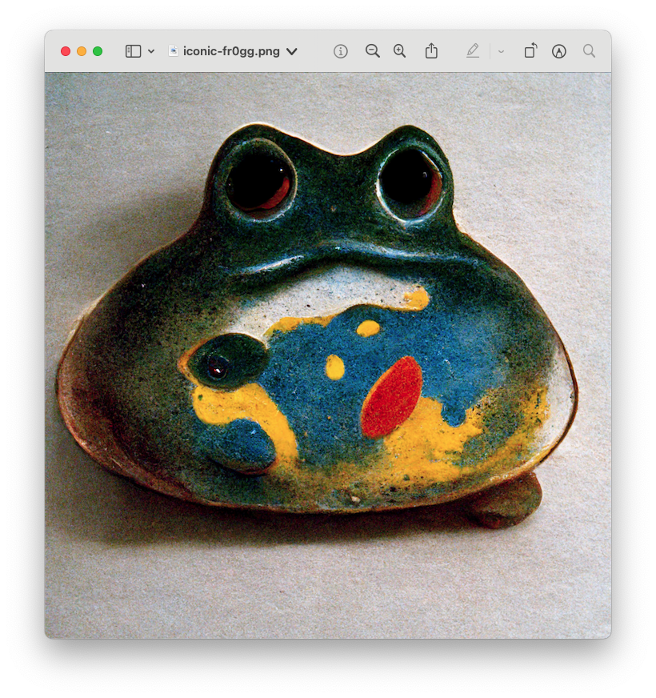
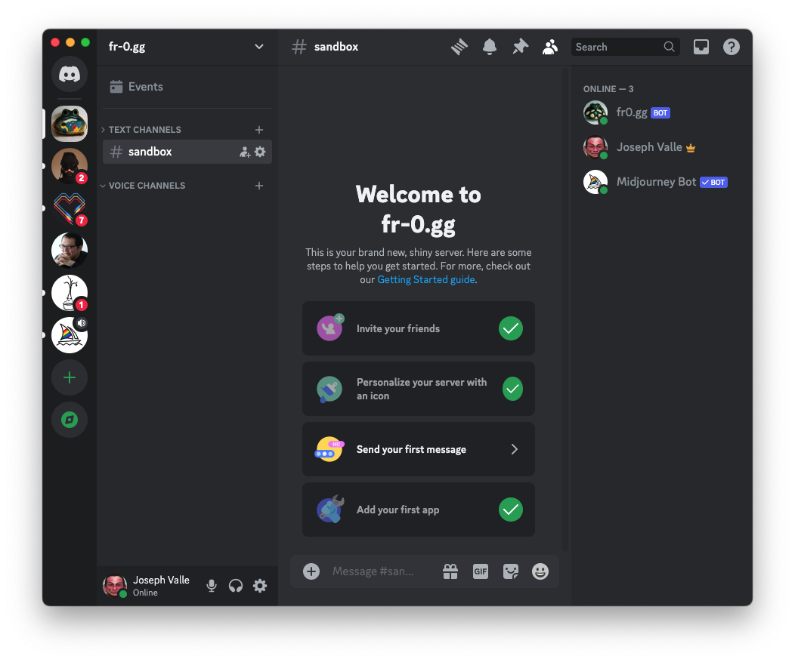
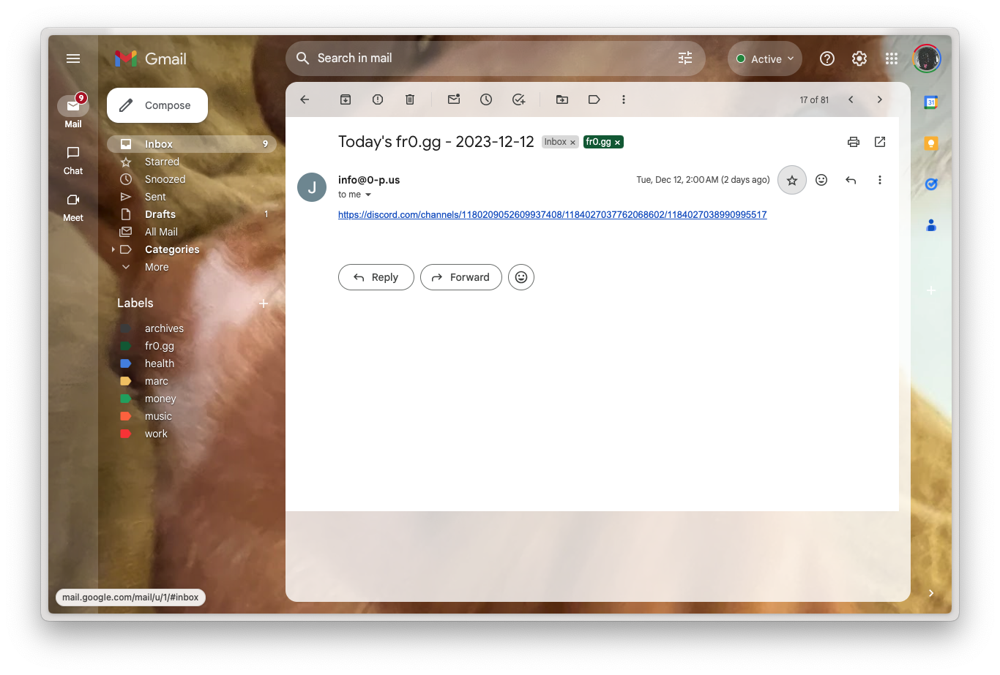
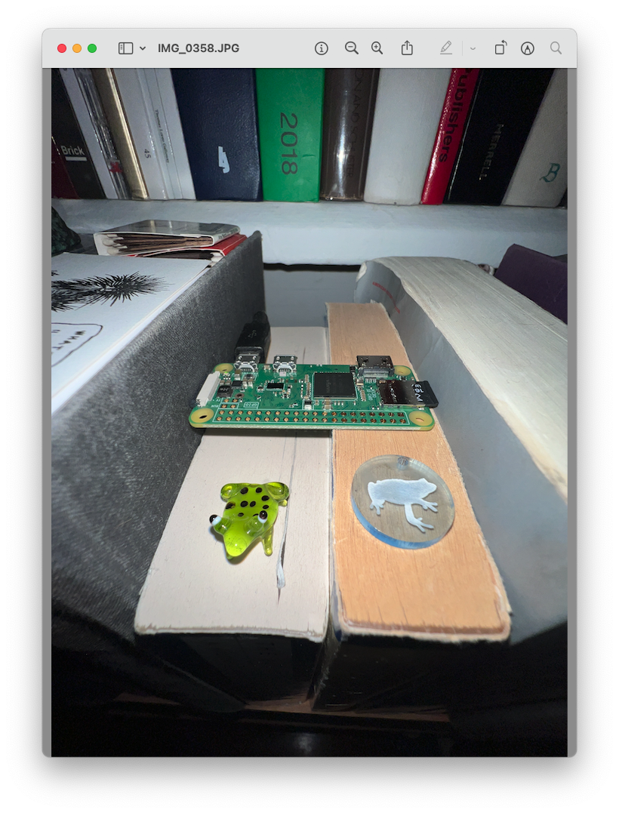

# fr-0.gg


fr-0gg is a project that grew out of my love of a few things: frogs, cheap handmade souvenirs, amateur ceramics, and Midjourney.

I started by building a simple Discord bot (fr-0gg-bot) that lives on a lilypad in the fr-0.gg Discord server alongside a Midjourney bot. 

The bot generates a **curated** but **random** Midjourney prompt daily and starts a new thread in the designated channel. It then adds the Midjourney bot to this thread, sends the day's prompt, and emails me with a direct link to the message. 

All of this behavior is a convoluted workaround for two unfortunate facts: 

1. There is *still* no public API for Midjourney.
2. Discord bots are *not allowed* to issue commands to one another. 



So until one of these things change, the fr-0gg-bot will continue to function in this way, requiring the tender touch of a **human operator**.

Anyways, once I click through the link and navigate into the Discord app, I copy the day's prompt and issue it as a command to the Midjourney bot. For example:

`
/imagine prompt: a small fat ceramic frog sculpture, oxidation fired, Agalychnis callidryas, souvenir from Cuba, full-color photograph, Pablo Picasso, Mark Rothko, textured white background, highly textured Xerox scan, archival museum catalog --no text, base, plinth  --stylize 750 --v 3
`

The content of the prompt was developed over time through my own experiments with Midjourney and pretty reliably creates an image within a certain style that I find delightfully charming. There are specific variables that I've found give the generated image enough variation to keep them interesting while still maintaining the visual language I'm after.

```python
def prompt():
    location = random.choice(location_list)
    artists = random.sample(artist_list, 2)
    species = random.choice(species_list)
    firing_style = random.choice(firing_styles)
    quality = random.choice(qualities_list)
    return f"a small {quality} ceramic frog sculpture, {firing_style}, {species}, souvenir from {location}, full-color photograph, {artists[0]}, {artists[1]}, textured white background, highly textured Xerox scan, archival museum catalog --no text, base, plinth  --stylize 750 --v 3"
```

After a bit of tweaking back-and-forth with the Midjourney bot, I eventually arrive at a new fr0gg that I'm happy with and issue the `!save` command to the bot, which triggers a series of functions that scrape the thread for the most recent image, uploads the image to a Cloudinary account, and finally adds the uploaded image reference to a Firebase Realtime Database. Then the bot just hangs around until it's time to create the next prompt.

The code for fr-0gg-bot itself lives inside a wifi-enabled Raspberry Pi module on my bookshelf.



The fr-0.gg front-end serves as a simple repository for all my fr0ggs.

ribbit 🐸

